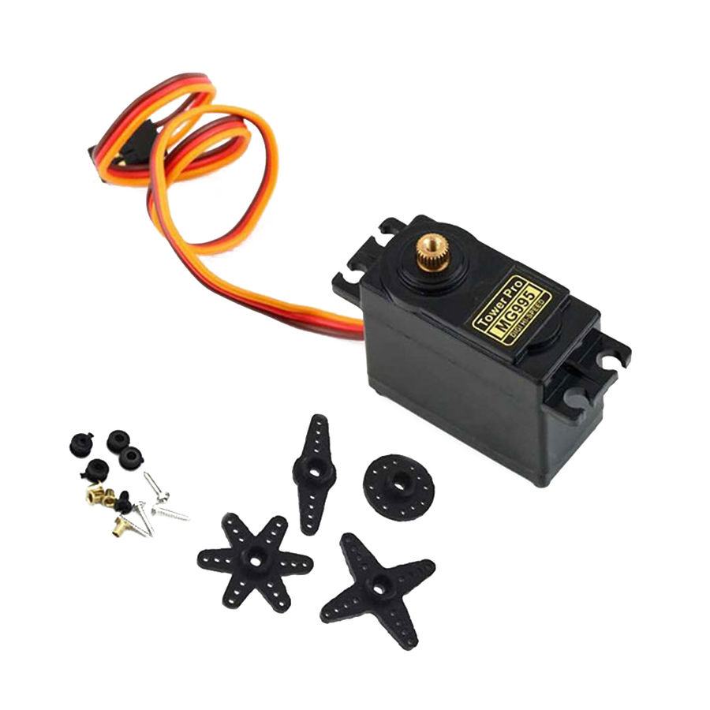

#### Video ####

  

Smart Pet Feeder enables the pet owners to feed their pets without their presence.

Smart Pet Feeder has 2 modes.

1)Simple Mode

In this mode, whenever pet goes to Smart Pet Feeder, if it waits in front of feeder for 7 seconds and meanwhile if its food container is empty,Smart Pet  Feeder automatically gives food as much as previously determined by user. 

2)Timed  Mode

In this mode, user has to specify exact time(s) and date(s) that he/she wants to feed his/her pet.

Instructions are sent using android application over bluetooth connection.I created separate classes for each components.

Components
1) STM32L476RG Nucleo Board

  

2) HX711 Amplifier And Load Cell (It is used for checking whether food bowl is empty and whether it reaches the amount previously determined while pouring food )

  
 
3) DS3231 Real Time Clock (It is used for keeping time and setting alarm.)

  
 
4) HC-05 Bluetooth Module (It is used for communication between app and Stm32.)

  
 
5) Grove Speaker (It used for warning pet when food time came in second mode.It plays theme of Pirates Of The Carribbean)

  
  
6) HC-SR04 Distance Sensor (It used for checking pet is going around food bowl or not in first mode.)

  
 
7) MG995 Servo Motor (Food will be stored in a box.It used for rotating that box to pour food into its bowl.)

  
   

In this project, i avoided using built-in libraries such as HAL,SPL... etc. I fully used register-level programming to understand how to program microcontroller.
I used 4 different peripherals.

1) GPIO (Digital input-output operations)
2) I2C (DS3231 communicates with STM32 using I2C.)
3) Timer (For both generation of PWM signal and creating us delay)
4) UART (HC05 communicates with STM32 using UART)

This project has been really beneficial for me to learn these peripherals and how to program them.I also used External Interrupt and Timer Interrupt.

As i mentioned in the beginning, instructions are sent to STM32 with android application over bluetooth connection.I programmed this android application using QT-C++.

  
  

