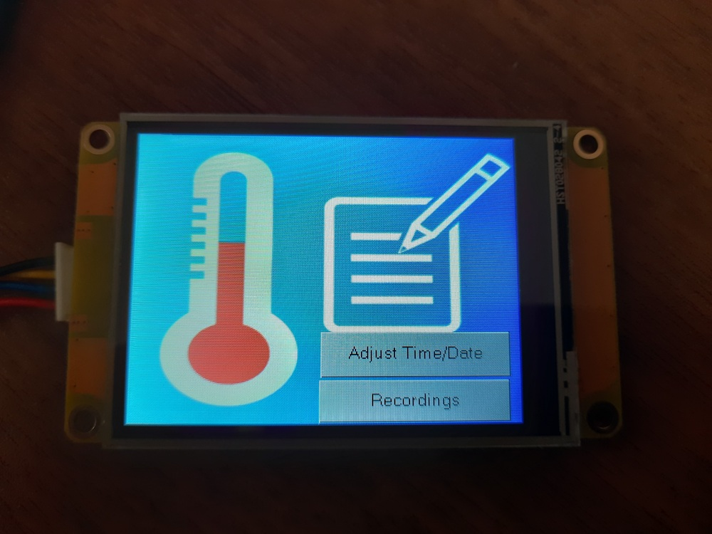
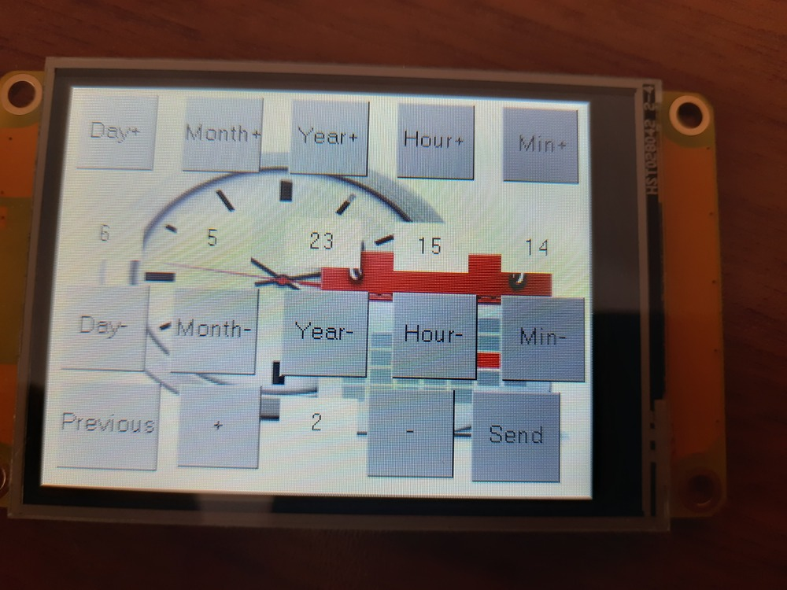
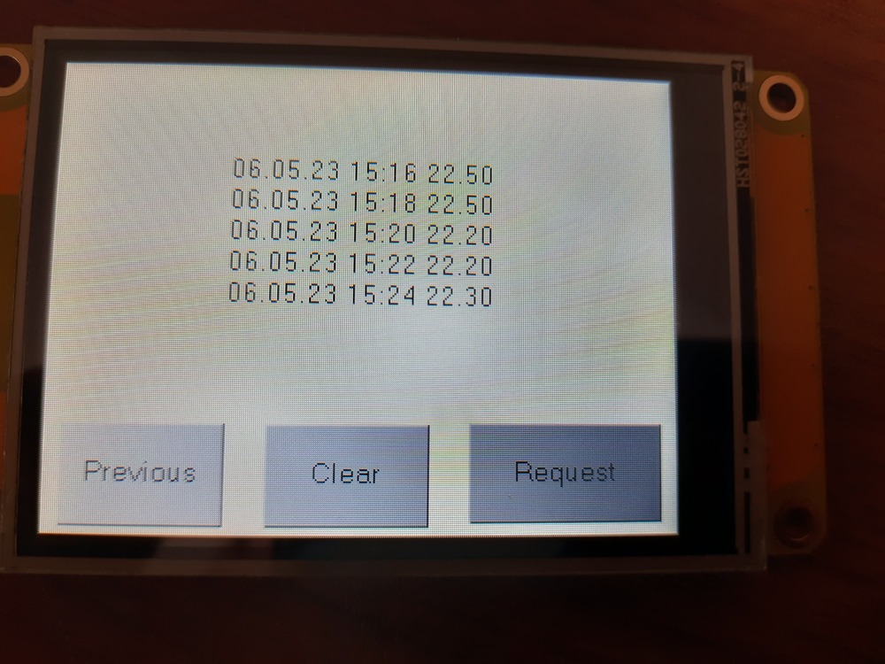

In this practice, i made a temperature logger.It records temperature in sd card periodically.User can specify this period.I used  BMP 180 as temperature sensor.It communicates microcontroller with I2C.I have a nextion display.It has an user interface.It communicates MCU with UART.I used STM32's internal RTC. I have a micro sd card and sd card reader.It communicates MCU with SPI.I used register level programming for I2C,UART and internal RTC.

#### Video ####

    

    

    

